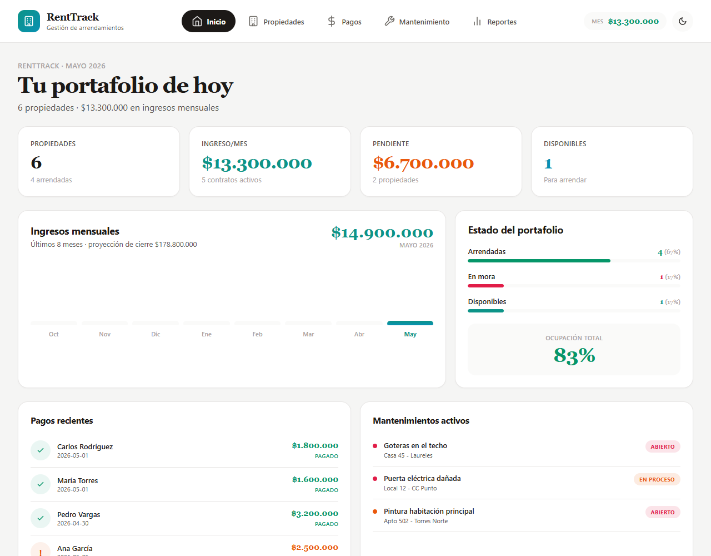
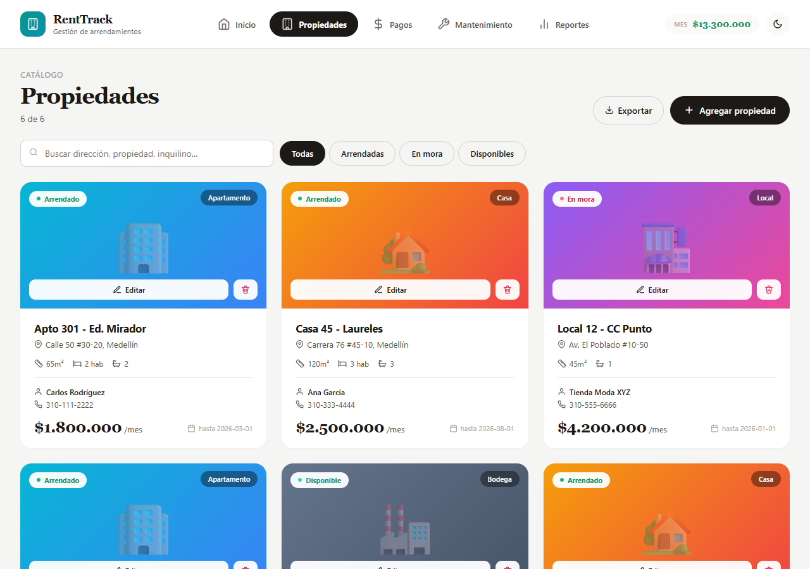
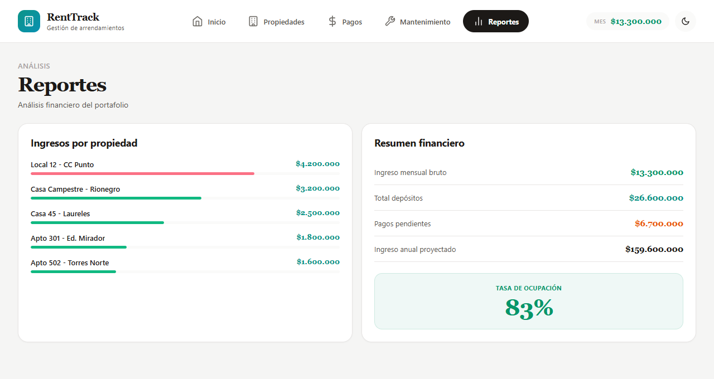

# RentTrack — Rental Property Management

[](https://github.com/Juanmaya25/renttrack-rentals/actions/workflows/ci.yml)
[](https://github.com/Juanmaya25/renttrack-rentals/actions/workflows/deploy.yml)
[](https://opensource.org/licenses/MIT)

> A portfolio dashboard for small landlords — properties, rent collection, maintenance tickets and financial reporting in one place, with an editorial real-estate aesthetic (serif headlines, Airbnb-style listing cards) and light/dark themes.

**Live demo → [juanmaya25.github.io/renttrack-rentals](https://juanmaya25.github.io/renttrack-rentals)**



> Dashboard: portfolio KPIs, an 8-month income bar chart, occupancy breakdown, recent payments and active maintenance.



> Properties: Airbnb-style listing cards with a type gradient, status badge, specs (area / rooms / baths), tenant info and monthly rent.



> Reports: rent contribution per property and a financial summary (gross monthly income, deposits, pending, projected annual) with the occupancy rate.

---

## The problem

A landlord with a handful of properties doesn't need property-management enterprise software — they need to know three things on the 5th of the month: who paid, what's broken, and whether the portfolio is fully occupied. Spreadsheets answer the first poorly and the other two not at all.

RentTrack is a single-screen portfolio manager: each property is a card with its tenant, contract dates and rent; payments are tracked through paid → pending → overdue with one-click "mark as paid"; maintenance tickets carry a priority and a lifecycle; and the dashboard + reports roll it all up into occupancy and income figures. Everything is in Colombian pesos and modelled on a real rental portfolio (deposits, contract end dates, property types).

## Architecture

Client-side React SPA (no backend; seed data ships in-bundle and lives in component state), organised by responsibility:

```
src/
├── App.jsx                 # Orchestrator: state, business actions, page routing (~230 lines)
├── main.jsx                # React entry point
├── index.css               # Reset, scrollbars, fade-in, responsive grid breakpoints
├── data/
│   ├── seed.js             # Properties, payments, maintenance, monthly-income series
│   └── themes.js           # Light/dark palettes + status/payment/maintenance color maps,
│                           #   property-type gradients & emoji
├── utils/
│   ├── format.js           # COP currency formatting
│   ├── csv.js              # CSV serialisation + browser download
│   ├── ids.js              # Sequential ID generation
│   └── styles.js           # Theme-derived inline style factory
├── hooks/
│   └── useToast.js         # Auto-dismissing toast with timer cleanup
├── components/
│   ├── icons.jsx           # Inline SVG icon set (no icon dependency)
│   ├── Header.jsx          # Top nav + monthly total + theme toggle
│   ├── Modal.jsx           # Modal shell + Field label helper
│   ├── ConfirmDialog.jsx, Toast.jsx
│   └── PropertyForm.jsx, PaymentForm.jsx, MaintenanceForm.jsx
└── pages/
    ├── Dashboard.jsx       # KPIs, income bars, occupancy, recent payments & maintenance
    ├── Properties.jsx      # Searchable/filterable Airbnb-style listing cards
    ├── Payments.jsx        # Collection KPIs + payments table with mark-as-paid
    ├── Maintenance.jsx     # Priority-ordered tickets with resolve action
    └── Reports.jsx         # Rent-per-property bars + financial summary
```

## Key decisions

| Decision | Why |
|---|---|
| **Refactored a monolithic `App.jsx` (~910 lines) into `data / utils / hooks / components / pages`** | The original held seed data, the palette, five page renderers and three modal forms in one file. Splitting by concern makes properties, payments and maintenance independently readable and testable, with the rendered UI kept identical. |
| **Charts built with CSS, no charting library** | The income bars and rent-contribution bars are plain flex/width divs driven by the data — zero dependencies, a smaller bundle, and full control over the editorial look. (This is the one product in the suite that ships without Recharts.) |
| **Portfolio metrics derived with `useMemo`** | Occupancy, monthly total and pending amounts are computed from the live property/payment state, so the dashboard, header and reports always agree. |
| **`Field` label helper colocated with `Modal`** | The three forms share one labelled-field primitive, keeping the property/payment/maintenance modals consistent without a separate design-system file. |
| **Pure utilities (`format`, `csv`, `ids`) covered by unit tests** | The logic most likely to regress silently is isolated and tested directly. |

## Tech stack

- **React 18** — hooks, `useMemo`, `useCallback`
- **Vite 5** — dev server + build
- **CSS-in-JS** — themed inline styles, no charting dependency
- **Vitest + Testing Library + jsdom** — unit and component tests
- **GitHub Actions + GitHub Pages** — CI (test + build) and CD

## Tests

```bash
npm test
```

15 tests across four suites:

- `utils/format.test.js` — COP formatting, null/NaN handling
- `utils/ids.test.js` — sequential ID generation
- `utils/csv.test.js` — header building, quote escaping, row serialisation
- `App.test.jsx` — render smoke test, tab navigation, status filtering, payments table, theme toggle

CI runs the full suite and a production build on every push and pull request.

## Run locally

```bash
git clone https://github.com/Juanmaya25/renttrack-rentals.git
cd renttrack-rentals
npm install
npm run dev      # http://localhost:5173/renttrack-rentals/
npm test         # run the test suite
npm run build    # production build to dist/
```

## Author

**Juan José Maya** — Full Stack Developer · San Pedro, Antioquia, Colombia

- Portfolio: [juanmaya25.github.io](https://juanmaya25.github.io)
- GitHub: [@Juanmaya25](https://github.com/Juanmaya25)
- Email: [juanjosemaya2510@gmail.com](mailto:juanjosemaya2510@gmail.com)

## License

MIT © Juan José Maya
